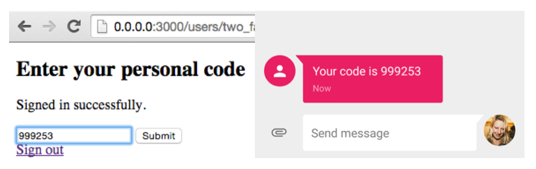
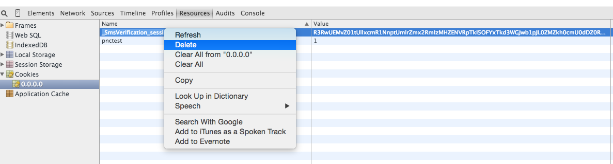

#Web Two-Factor Authentication Using Rails, Devise, and Sinch - Part 3

This tutorial builds on [part 1](https://www.sinch.com/tutorials/ruby-on-rails-authentication/) of my two-factor authentication series. Please make sure you have completed part 1, as that takes care of setup and some of the database.

When users sign up for your app, they will be prompted to enter their phone number. Every time they sign in after that, a one-time password (OTP) will be texted to their phone. They will type that OTP into the website as a second step of the login process.

##Create a welcome controller
I set up a simple welcome controller to redirect to when the user is logged in. 

1. Create **app/controllers/welcome_controller.rb**, add working skeleton         
        
        class WelcomeController < ApplicationController    
            before_filter :authenticate_user!    
            def index    
            end    
        end 
                 
2. Create the view in **app/views/welcome/index.html.erb**. You can make this view look however you like.
3. Make your root route `welcome#index` in **routes.rb**

        root 'welcome#index'
    
Now, when users try to access your root domain, they will have to login.

##Set up Devise gem

I chose to use the gem [Devise](https://github.com/plataformatec/devise) to handle user authentication. After setting up the basic login with Devise, we'll customize it to require two-factor authentication. 

1. Add `gem 'devise'` to your gemfile
2. Run `$ bundle install`
3. Run `$ rails generate devise:install`
4. Run `$ rails generate devise User`
5. Run `$ rake db:migrate`

##Add phone number field to user signup

First, add a phone number column to your users table:

1. Run `$ rails g migration AddPhoneNumberToUsers`
2. Edit migration file to look like this:  
   
        class AddPhoneNumberToUsers < ActiveRecord::Migration
          def change
      	    add_column :users, :phone_number, :string
          end
        end
        
3. Run `$ rake db:migrate`

Now, create a custom registration controller to require a phone number when signing up. Create the file **app/controllers/registrations_controller.rb**, have it inherit from the Devise registrations controller, and modify the Devise method sign_up_params.

    class RegistrationsController < Devise::RegistrationsController
      private
      def sign_up_params
        params.require(:user).permit(:phone_number, :email, :password, :password_confirmation)
      end
    end 

Then, in your routes file, change `devise_for :users` to `devise_for :users, :controllers => { registrations: 'registrations' }`. 

Lastly, add a phone number field to the signup view. To override the default Devise view, create **app/views/regsitrations/new.html.erb**. Here is an example of how your view will look when you take the default Devise signup view and just add a phone number field at the top.

    <h2>Sign up</h2>

    <%= form_for(resource, as: resource_name, url: registration_path(resource_name)) do |f| %>
      <%= devise_error_messages! %>
    
      

        <%= f.label :phone_number %> 
        <%= f.text_field :phone_number, autofocus: true %>
      

    
      

        <%= f.label :email %> 
        <%= f.email_field :email %>
      

    
      

        <%= f.label :password %>
        <% if @minimum_password_length %>
        <em>(<%= @minimum_password_length %> characters minimum)</em>
        <% end %> 
        <%= f.password_field :password, autocomplete: "off" %>
      

    
      

        <%= f.label :password_confirmation %> 
        <%= f.password_field :password_confirmation, autocomplete: "off" %>
      

    
      

        <%= f.submit "Sign up" %>
      

    <% end %>
    
    <%= render "devise/shared/links" %>

##Set up two_factor_authentication gem

1. Add `gem 'two_factor_authentication'` to your gemfile
2. Run `$ bundle install`
3. Run `$ bundle exec rails g two_factor_authentication user`
4. Run `$ bundle exec rake db:migrate`
5. Add `has_one_time_password` to the user model. Your user model should look like this:    

 
   
    class User < ActiveRecord::Base
      devise :two_factor_authenticatable, :database_authenticatable, :registerable,
                :recoverable, :rememberable, :trackable, :validatable
                
      has_one_time_password
      
      def send_two_factor_authentication_code
        #send sms with code!
      end
    end
    

##Send SMS using Sinch
For this part, we are going to be using [SMS verification](https://www.sinch.com/products/verification/sms-verification/). This is very simple since you already have the `sinch_sms gem` included in your project. In `send_two_factor_authentication_code`, add the following line with your unique Sinch key and secret.

    SinchSms.send('YOUR_APP_KEY', 'YOUR_APP_SECRET', "Your code is #{otp_code}", phone_number)
    
Now you're ready to try your two-factor authentication system. Spin up a local Rails server, navigate to the root URL, sign up as a new user, sign out, and try logging back in as that same user.

**Note:** You need to format the phone number according to [E.164](http://en.wikipedia.org/wiki/E.164) standards. For example, U.S. numbers need 1 + 3 digit area code + 7 digit phone number.

##Logging out
To keep things simple, I didn't create a logout button. It's very to simple to logout by deleting the session cookie. In Chrome, open the developer tools by right-clicking anywhere on the page and choosing 'Inspect Element.' (It's similar in other browsers too.) Then, go to the 'Resources' tab and find the token that represents your app. See the screenshot below for a clear explanation of what to delete.

Once deleted, refresh the page and you will be prompted to sign in.
