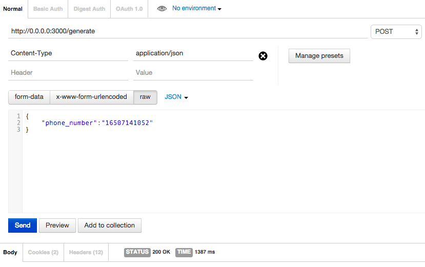
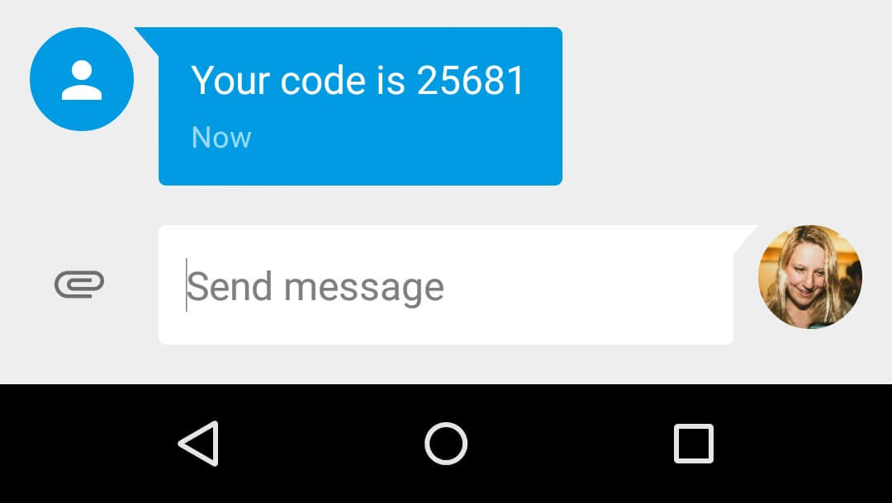
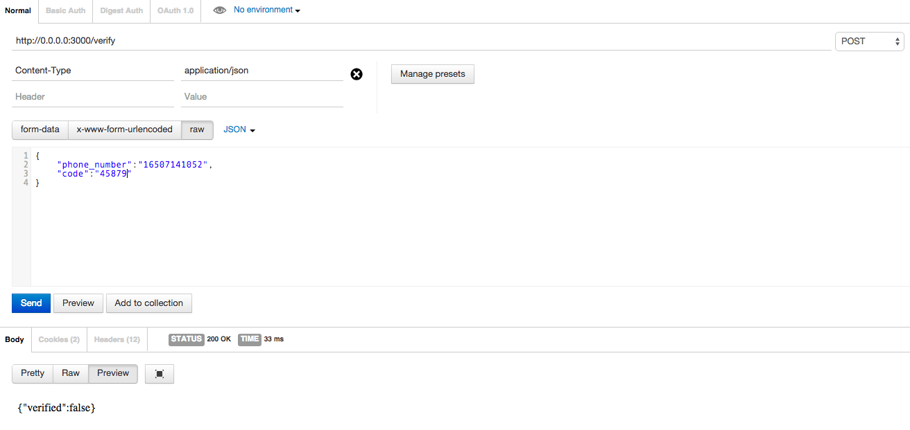

#Number Verification And Two Factor Authentication (Android/Ruby on Rails)

More and more websites and apps rely on knowing your phone number and in many cases using that number for two factor authentication (more info about 2FA here [www.sinch.com/opinion/what-is-two-factor-authentication](https://www.sinch.com/opinion/what-is-two-factor-authentication/)).

In this tutorial you will learn how to build your own two factor system in about 30 minutes. In [part 2](https://www.github.com/ruby-two-factor-auth) we will implement it in an Android app. 

The full sample code can be downloaded [here](https://github.com/sinch/ruby-two-factor-auth).

##Prerequisites 
1. Good understanding of Ruby on Rails and REST APIs
2. A Sinch account [http://sinch.com/signup](http://sinch.com/signup)

##Create a Project

Create a new rails project and a verification controller:

    $ rails new YourProjectName --database=postgresql 
    $ cd YourProjectName    
    $ rails generate controller Verifications
    
I chose to use a postgres database for my app to make hosting on Heroku easy, since they do not support the default sql database.
    
##Set up routes

Add to **routes.rb**:

    post '/generate' => 'verifications#generate_code'
    post '/verify' => 'verifications#verify_code'

##Set up Database

Create a table to store pairs of phone numbers and OTP codes:

    $ rails generate migration CreateVerifications phone_number:string code:string
    $ rake db:create
    $ rake db:migrate

Then, create the file **app/models/verification.rb** with the following:

    class Verification < ActiveRecord::Base
        validates_presence_of :phone_number, :code
    end

##Add sinch_sms Gem

You'll want to use Sinch to send SMS with the OTP (one time password) codes. Add `gem 'sinch_sms'` to your gem file and then bundle install.

##Generating and Verifying OTP Codes

In **app/controllers/verifications_controller.rb** `generate_code`, you will:

1. generate random code
2. create new object with phone number
3. send an sms with the code

In `verify_code`, you will:

1. see if there is a verification entry that matches the phone number and code
2. if yes, destroy the entry and return {"verified":true} 
3. if no, return {"verified":false} 

<b></b>  
                     

    class VerificationsController < ApplicationController
    	skip_before_filter :verify_authenticity_token
    
    	def generate_code
    		phone_number = params["phone_number"]
    		code = Random.rand(10000..99999).to_s
    
    		Verification.create(phone_number: phone_number, code: code)
    		SinchSms.send('YOUR_APP_KEY', 'YOUR_APP_SECRET', "Your code is #{code}", phone_number)
    
    		render status: 200, nothing: true
    	end
    
    	def verify_code
    		phone_number = params["phone_number"]
    		code = params["code"]
    		verification = Verification.where(phone_number: phone_number, code: code).first
    
    		if verification
    		   verification.destroy
    			render status: 200, json: {verified: true}.to_json
    		else
    			render status: 200, json: {verified: false}.to_json
    		end
    	end
    end

In a production application you would most likely use Sinch to verify the format of a number before sending.

Also, one thing you might want to add in a production app is to wait to return until Sinch knows the message has been delivered to the operator by using:

    SinchSms.status(key, secret, message_id);

## Testing with Postman
I like to use postman for chrome to test out my rest apis. You can get it [here](https://chrome.google.com/webstore/detail/postman-rest-client/fdmmgilgnpjigdojojpjoooidkmcomcm?hl=en). 

Use `$ rails s` to start a local rails server and take note of the port. In my case it was 3000.

In Postman, generate a code:

See the code arrive in an SMS:

And then verify the code:

##Hosting
If you're going to follow part 2 of this tutorial, you will need to host this backend somewhere. I chose [Heroku](http://www.heroku.com), since it's easy to host a rails app, and has a huge free tier. After you've created an account, follow the steps on their site to deploy your app - [https://devcenter.heroku.com/articles/getting-started-with-rails4#deploy-your-application-to-heroku](https://devcenter.heroku.com/articles/getting-started-with-rails4#deploy-your-application-to-heroku). Make sure to follow through the section on migrating your database. 

## Next Step
In the next step of this tutorial, I will show you how to use this in a native Android app.
 
